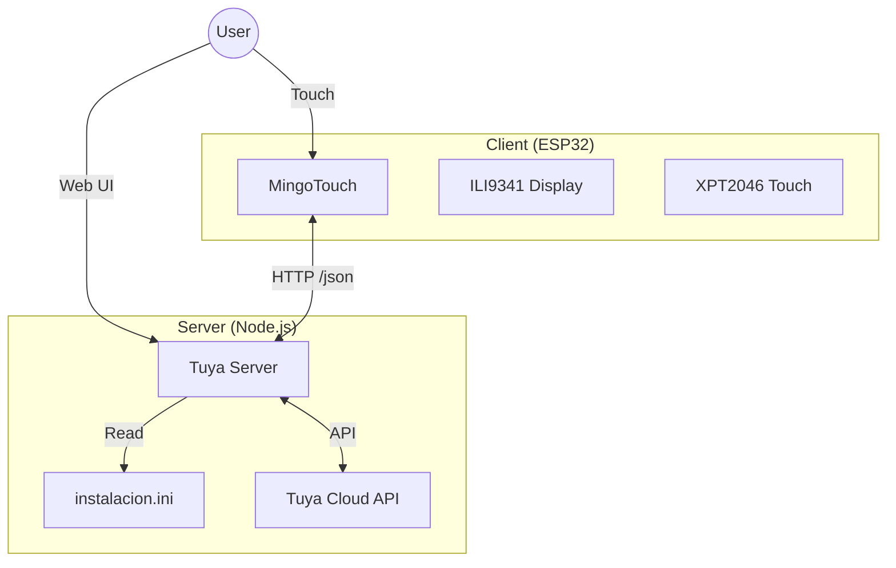

# Tuya & MingoTouch Project Knowledge Base

This document consolidates the architectural, configuration, and operational knowledge for the Tuya Smart Home system, composed of a Node.js server (`tuya`) and an ESP32-based touch interface (`tuyaio` / MingoTouch).

## 1. System Architecture

The system follows a Client-Server architecture:

## 2. Server: `tuya` (Node.js)

*   **Location**: `R:\home\philippe\node.js\tuya` (Mapped from Raspberry Pi)
*   **Role**: Central Hub. Manages device state, acts as a bridge to Tuya Cloud, and serves configuration to clients.
*   **Key Files**:
    *   `server.mjs`: Main entry point.
    *   `instalacion.ini`: **Source of Truth** for device configuration.
    *   `public/`: Hosting for the Web UI.

### Configuration (`instalacion.ini`)
Devices are defined in sections `[ID]`. Key parameters for MingoTouch integration:
*   `Esp32Dsp`: ID of the physical ESP32 panel (e.g., `1`).
*   `Esp32Pag`: Page number on the screen (Determines order).
*   `Esp32Tip`: Widget type. Options: `Consumo`, `Clima`, `Luz`, `Enchufe`.
*   `MostrarGrafico`: (Device specific) Toggle for charts.

### Key Endpoints
*   `/estados`: Returns a monolithic JSON with the state of all devices.
*   `/mingotouchs`: Used for the Web UI drag-and-drop editor.
*   `/esp32?esp32=ID`: Returns the list of devices configured for a specific ESP32 ID.

## 3. Client: `tuyaio` (ESP32 PlatformIO)

*   **Location**: `C:\Users\Philippe\Documents\Mis Fuentes\platformio\tuyaio`
*   **Hardware**: ESP32-2432S024C ("Cheap Yellow Display").
*   **Framework**: PlatformIO / Arduino.
*   **Key Files**:
    *   `src/main.cpp`: Main logic (Rendering, WiFi, Touch).
    *   `src/config.h`: Static configuration (WiFi creds, Server URL).
    *   `platformio.ini`: Build configuration.

### Core Concepts
*   **LovyanGFX**: Used for graphics. Configured with 8-bit color depth to save RAM (`~76KB` used vs `~150KB`).
*   **Dynamic Config**: The `DEVICES` vector in `config.h` is a placeholder. The actual config is fetched from the server at startup (`fetchDeviceConfig()`).
*   **Fonts**: Stored on SD/LittleFS (`font.vlw`). UTF-8 support enabled for Spanish accents.
*   **Theme**: Supports "dia" and "noche" modes.

## 4. Operational Workflows

### Authentication & Config Sync
1.  **Startup**: ESP32 connects to WiFi.
2.  **Config Fetch**: Requests `SERVER_URL + esp32?esp32=1`.
3.  **Parsing**: Overwrites local `DEVICES` list with the received JSON.
4.  **Loop**:
    *   Every **5 mins**: Refreshes Device Config.
    *   Every **10 secs**: Refreshes Device Status (`/estados`).

### The "MingoTouch" Simulator
A web-based simulator exists in the Node.js project (`public/`) to replicate the ESP32 UI. It helps in debugging layout changes without flashing the device.
*   **Sync**: It uses the same logical endpoints as the physical device.

## 5. Recent Developments & Fixes
*   **Phase A Decoding**: Implemented custom decoding for `phase_a` string to extract voltage/amperage/power from raw Tuya data.
*   **Time Sync**: Fixed a 1-hour offset issue (GMT/DST handling).
*   **UI Polish**:
    *   Horizontal rule thickness increased to 3px.
    *   Fixed color ordering (RGB/BGR) for correct display.
    *   Sanitized strings to handle Spanish accents without special font requirements (memory optimization).
*   **Stability**: Fixed `TFT_eSPI` build errors and `MemberProxy` variadic template issues in C++.

## 6. How to Work in this Environment
*   **Editing**: Always open the workspace that includes both folders if possible, or be aware of the `R:` drive mapping.
*   **Deployment**:
    *   **Server**: Edit `server.mjs` -> Restart Node service (`sudo systemctl restart node-server` or via PM2).
    *   **ESP32**: Code in `tuyaio` -> Build (`PlatformIO: Build`) -> Upload (`PlatformIO: Upload`).
